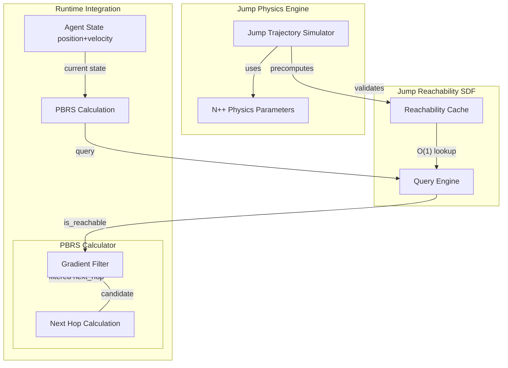

# Jump Reachability SDF for PBRS Filtering

## Overview

Implement a velocity-aware Jump Reachability System that determines which positions are physically reachable from the agent's current state (position + velocity), and use it to filter PBRS next-hop guidance. This prevents the agent from being guided toward positions that require impossible jumps, particularly over mines.**Key Design Decisions:**

- **Purpose:** Filter PBRS gradient (don't guide toward unreachable positions)
- **Scope:** Level-wide precomputed data structures
- **Representation:** Binary (can reach / cannot reach)
- **Dynamics:** Velocity-aware (considers current momentum)

## Architecture




## Implementation Plan

### Phase 1: Jump Trajectory Simulator

**File:** Create `nclone/nclone/graph/reachability/jump_trajectory_simulator.py`Implement physics-accurate jump trajectory simulation using N++ mechanics:

```python
class JumpTrajectorySimulator:
    """Simulate N++ jump trajectories with velocity-aware reachability.
    
    Physics constants from sim_mechanics_doc.md:
                - Ground accel: 0.0667
                - Air accel: 0.0444
                - Gravity (fall): 0.0667
                - Gravity (jump): 0.0667
                - Max horizontal speed: 3.333
                - Jump flat ground Y: -2.0
                - Terminal impact threshold: ~4.0 vertical velocity
    """
    
    def can_reach_position(
        self,
        src_pos: Tuple[float, float],
        dst_pos: Tuple[float, float],
        current_velocity: Tuple[float, float],
        level_data: LevelData,
        adjacency: Dict,
        max_simulation_steps: int = 300,
    ) -> bool:
        """Simulate if agent can reach dst_pos from src_pos given current velocity.
        
        Returns True if ANY action sequence can reach destination without:
                                - Hitting walls/tiles
                                - Hitting mines
                                - Terminal impact death
                                - Timeout (>max_simulation_steps)
        """
```

**Key Methods:**

1. `simulate_trajectory(start_pos, start_vel, actions, level_data)` - Full physics simulation
2. `can_reach_position(src, dst, velocity, level_data)` - Reachability check
3. `find_jump_arc(src, dst, velocity)` - Find action sequence if reachable
4. `check_collision_along_path(trajectory, level_data)` - Validate trajectory safety

**Physics Simulation:**

- Frame-by-frame integration (60 FPS)
- Velocity updates: `vx += ax * dt`, `vy += (ay + gravity) * dt`
- Position updates: `x += vx * dt`, `y += vy * dt`
- Action effects: Jump (set vy), horizontal input (set ax)
- Collision detection: Check tiles, mines, walls at each frame

### Phase 2: Reachability Cache Structure

**File:** Create `nclone/nclone/graph/reachability/jump_reachability_cache.py`Efficient storage and querying for reachability data:

```python
class JumpReachabilityCache:
    """Cache for velocity-aware jump reachability queries.
    
    Strategy:
                - Spatial hash grid for O(1) position lookups
                - Velocity binning (8 directions × 3 speed ranges = 24 bins)
                - Precompute reachable sets for each (position, velocity_bin) pair
    
    Memory optimization:
                - Store only reachable destinations (sparse)
                - Use spatial hash for efficient neighbor queries
                - Velocity binning reduces state space (continuous → discrete)
    """
    
    def __init__(self, level_data: LevelData, adjacency: Dict):
        self.spatial_hash = {}  # pos -> reachable_positions_by_velocity_bin
        self.velocity_bins = self._create_velocity_bins()
        
    def is_reachable(
        self,
        src_pos: Tuple[float, float],
        dst_pos: Tuple[float, float],
        velocity: Tuple[float, float],
    ) -> bool:
        """O(1) lookup for reachability query."""
        velocity_bin = self._discretize_velocity(velocity)
        src_grid = self._snap_to_grid(src_pos)
        dst_grid = self._snap_to_grid(dst_pos)
        
        reachable_set = self.spatial_hash.get((src_grid, velocity_bin), set())
        return dst_grid in reachable_set
```

**Velocity Binning:**

```python
# Discretize continuous velocity into bins
# Direction: 8 cardinal/diagonal directions
# Speed: 3 ranges (slow <1.0, medium 1.0-2.5, fast >2.5)
VELOCITY_BINS = {
    'stationary': (0, 0),
    'right_slow': (1, 0), 'right_medium': (2, 0), 'right_fast': (3, 0),
    'left_slow': (-1, 0), 'left_medium': (-2, 0), 'left_fast': (-3, 0),
    # ... up, down, diagonal bins ...
}
```

**Spatial Grid:**

- Grid cell size: 24px (tile size) or 12px (sub-node size)
- Snap positions to grid for consistent lookups
- Trade-off: Coarser grid = less memory, lower precision

### Phase 3: Precomputation System

**File:** Extend `nclone/nclone/graph/reachability/graph_builder.py`Add reachability precomputation during graph building:

```python
class GraphBuilder:
    def build_jump_reachability_cache(
        self,
        level_data: LevelData,
        adjacency: Dict,
        physics_cache: Dict,
    ) -> JumpReachabilityCache:
        """Precompute jump reachability for all relevant state combinations.
        
        Strategy:
                                1. Identify all graph nodes (potential starting positions)
                                2. For each node and velocity bin:
                                            - Simulate jumps to all neighbors within jump range (~200px)
                                            - Record which destinations are reachable
                                            - Store in cache
        
        Optimization:
                                - Only compute for grounded nodes (starting positions)
                                - Limit search radius (agent can't jump 500px)
                                - Parallel processing for large levels
        """
```

**Precomputation Flow:**

1. Extract all grounded nodes from adjacency graph
2. For each grounded node:

- For each velocity bin (24 bins):
                - Find all nodes within max jump range (150-200px radius)
                - For each candidate destination:
                - Simulate trajectory with JumpTrajectorySimulator
                - If reachable: Add to reachable_set

3. Store results in JumpReachabilityCache

**Performance Considerations:**

- Precomputation time: ~1-5 seconds per level (acceptable during graph build)
- Cache per level (invalidates on level change)
- Shared cache for multi-worker training (same as current level cache)

### Phase 4: PBRS Integration - Gradient Filtering

**File:** Modify `nclone/nclone/gym_environment/reward_calculation/pbrs_potentials.py`Add reachability filtering to next-hop calculation:

```python
def get_path_gradient_from_next_hop(
    player_pos: Tuple[float, float],
    adjacency: Dict[Tuple[int, int], List[Tuple[Tuple[int, int], float]]],
    level_cache: Any,
    goal_id: str,
    spatial_hash: Optional[Any] = None,
    subcell_lookup: Optional[Any] = None,
    use_multi_hop: bool = True,
    # NEW PARAMETER
    jump_reachability_cache: Optional[JumpReachabilityCache] = None,
    current_velocity: Optional[Tuple[float, float]] = None,
) -> Optional[Tuple[float, float]]:
    """Get path gradient with jump reachability filtering.
    
    NEW BEHAVIOR:
                - Get next_hop from level cache (unchanged)
                - IF jump_reachability_cache provided:
                                - Check if next_hop is reachable given current velocity
                                - If NOT reachable: Return None (no gradient guidance)
                                - If reachable: Return gradient as normal
                - ELSE: Return gradient as normal (backward compatibility)
    """
    
    # Get next_hop from level cache (existing logic)
    next_hop_world = level_cache.get_next_hop(...)
    if next_hop_world is None:
        return None
    
    # NEW: Reachability filtering 
    if jump_reachability_cache is not None and current_velocity is not None:
        is_reachable = jump_reachability_cache.is_reachable(
            player_pos, next_hop_world, current_velocity
        )
        
        if not is_reachable:
            # Next hop requires impossible jump - don't guide agent there
            logger.debug(
                f"[JUMP_FILTER] Next hop {next_hop_world} unreachable from "
                f"{player_pos} with velocity {current_velocity}. "
                f"Suppressing PBRS gradient to prevent impossible jump guidance."
            )
            return None  # Return None = zero PBRS gradient this step
    
    # Compute and return gradient (existing logic)
    dx = next_hop_world[0] - player_pos[0]
    dy = next_hop_world[1] - player_pos[1]
    distance = (dx * dx + dy * dy) ** 0.5
    if distance < 0.1:
        return None
    return (dx / distance, dy / distance)
```

**Effect on PBRS:**

```python
# When next_hop is unreachable:
path_gradient = None  # Suppressed by reachability filter

# PBRS potential calculation uses path_gradient:
if path_gradient is None:
    # No gradient this step = zero PBRS reward
    # Agent doesn't get misguided toward impossible jump
    pbrs_reward = 0.0
else:
    # Normal PBRS calculation
    pbrs_reward = gamma * potential_next - potential_current
```


### Phase 5: Runtime Integration

**File:** Modify `nclone/nclone/gym_environment/reward_calculation/main_reward_calculator.py`Pass velocity to PBRS calculator:

```python
class RewardCalculator:
    def calculate_reward(self, obs, prev_obs, action, frames_executed, curriculum_manager):
        # Extract current velocity from observation
        current_velocity = (
            obs.get("player_x_speed", 0.0),
            obs.get("player_y_speed", 0.0)
        )
        
        # Calculate PBRS with velocity-aware reachability filtering
        current_potential = self.pbrs_calculator.calculate_combined_potential(
            current_pos=current_player_pos,
            state_dict=obs,
            adjacency=adjacency,
            level_data=level_data,
            graph_data=graph_data,
            scale_factor=scale_factor,
            # NEW: Pass velocity for reachability filtering
            current_velocity=current_velocity,
        )
```

**File:** Modify `nclone/nclone/gym_environment/reward_calculation/pbrs_potentials.py`Update `PBRSCalculator` methods:

```python
class PBRSCalculator:
    def __init__(self, path_calculator, momentum_waypoints, reward_config, jump_reachability_cache=None):
        # ... existing init ...
        self.jump_reachability_cache = jump_reachability_cache
    
    def calculate_combined_potential(
        self,
        current_pos: Tuple[float, float],
        state_dict: Dict[str, Any],
        adjacency: Dict,
        level_data: Any,
        graph_data: Optional[Dict[str, Any]] = None,
        scale_factor: float = 1.0,
        # NEW PARAMETER
        current_velocity: Optional[Tuple[float, float]] = None,
    ) -> float:
        """Calculate potential with velocity-aware reachability filtering."""
        
        # Get path gradient with reachability filtering
        path_gradient = get_path_gradient_from_next_hop(
            current_pos,
            adjacency,
            level_cache,
            goal_id,
            spatial_hash=spatial_hash,
            subcell_lookup=subcell_lookup,
            use_multi_hop=True,
            # NEW: Pass reachability cache and velocity
            jump_reachability_cache=self.jump_reachability_cache,
            current_velocity=current_velocity,
        )
        
        # If gradient is None (unreachable next_hop), potential stays same as previous
        # This results in zero PBRS reward: gamma * phi_current - phi_prev = 0
```


### Phase 6: Cache Management

**File:** Modify `nclone/nclone/gym_environment/base_environment.py`Initialize and share jump reachability cache:

```python
class BaseNppEnvironment:
    def __init__(self, ..., shared_jump_reachability_cache=None):
        # ... existing init ...
        self.shared_jump_reachability_cache = shared_jump_reachability_cache
    
    def reset(self, seed=None, options=None):
        # ... existing reset logic ...
        
        # Build or retrieve jump reachability cache
        if self.shared_jump_reachability_cache is not None:
            # Multi-worker: Use shared cache
            jump_cache = self.shared_jump_reachability_cache
        else:
            # Single-worker: Build per-level cache
            jump_cache = self.graph_builder.build_jump_reachability_cache(
                self.level_data,
                self.current_graph_data["adjacency"],
                self.current_graph_data["node_physics"],
            )
        
        # Pass to reward calculator
        self.reward_calculator.pbrs_calculator.jump_reachability_cache = jump_cache
```

**Shared Cache Strategy:**

- For single-level training: Share jump reachability cache across workers (same as level cache)
- For multi-level training: Build per-level, cache in level cache system
- Invalidation: When level changes or mine states change

### Phase 7: Performance Optimizations

**Optimizations to Consider:**

1. **Lazy Computation:**

- Don't precompute full level at start
- Compute on-demand for visited regions
- Cache results for future queries

2. **Spatial Partitioning:**

- Divide level into regions (e.g., 200x200px tiles)
- Only precompute reachability within and between adjacent regions
- Reduces state space significantly

3. **Velocity Bin Reduction:**

- Instead of 24 bins, use fewer (e.g., 8 directions only, ignore speed)
- Trade accuracy for memory/computation

4. **Approximate Reachability:**

- Use heuristics instead of full simulation for distant positions
- Full simulation only for nearby positions (<100px)

5. **Parallel Precomputation:**

- Use multiprocessing to precompute reachability for different regions
- Significant speedup for large levels

### Phase 8: Testing and Validation

**Test Suite:**

1. **Unit Tests:** `tests/test_jump_reachability.py`

- Test trajectory simulator accuracy against known jumps
- Verify velocity binning is consistent
- Check cache lookup correctness

2. **Integration Tests:** `tests/test_pbrs_reachability_filtering.py`

- Verify PBRS gradient is suppressed for unreachable positions
- Confirm waypoint bonuses still work when PBRS is filtered
- Test edge cases (zero velocity, terminal velocity, etc.)

3. **Visual Debugging:** `scripts/debug_jump_reachability.py`

- Render jump reachability overlay on level visualization
- Show reachable/unreachable regions for different velocities
- Highlight filtered next-hops during episode playback

## Expected Benefits

1. **Prevents Impossible Jump Guidance:**

- Agent no longer gets positive PBRS for moving toward positions requiring impossible jumps
- Reduces "try doomed shortcut → fall into mines" failure mode

2. **Complements Waypoint System:**

- Waypoints guide along safe path (positive signal)
- Jump reachability prevents shortcuts (removes misleading signal)
- Combined: Strong guidance toward correct behavior

3. **Physics-Aware Learning:**

- Agent implicitly learns jump limitations through filtered gradients
- Reduces exploration of impossible actions
- Faster convergence to feasible policies

## Potential Challenges

1. **Computational Cost:**

- Precomputation may take 1-5 seconds per level
- Memory usage: ~1-10 MB per level depending on cache strategy
- Mitigation: Shared cache, lazy computation, spatial partitioning

2. **Simulation Accuracy:**

- Jump trajectory simulator must match N++ physics exactly
- Small errors can cause false positives/negatives
- Mitigation: Extensive validation against real game physics

3. **Velocity Discretization:**

- Binning continuous velocity may lose precision
- Agent at bin boundary may get inconsistent guidance
- Mitigation: Conservative reachability (mark as unreachable if uncertain)

4. **Dynamic Obstacles:**

- Mine states can change (toggle mines)
- Reachability cache must invalidate when mines toggle
- Mitigation: Track mine state changes, rebuild cache when needed

## Integration with Existing System

**Backward Compatibility:**

- Jump reachability is OPTIONAL (pass `None` to disable)
- If not provided, PBRS works exactly as before
- Gradual rollout: Test on subset of trials first

**Hyperparameter Tuning:**

- May need to adjust PBRS weight with reachability filtering
- Waypoint bonuses may need rebalancing
- Monitor training metrics to validate improvement

## Files to Create/Modify

### New Files:

1. `nclone/nclone/graph/reachability/jump_trajectory_simulator.py` - Physics simulation
2. `nclone/nclone/graph/reachability/jump_reachability_cache.py` - Cache structure
3. `tests/test_jump_reachability.py` - Unit tests
4. `tests/test_pbrs_reachability_filtering.py` - Integration tests
5. `scripts/debug_jump_reachability.py` - Visual debugging tool

### Modified Files:

1. `nclone/nclone/graph/reachability/graph_builder.py` - Add precomputation
2. `nclone/nclone/gym_environment/reward_calculation/pbrs_potentials.py` - Gradient filtering
3. `nclone/nclone/gym_environment/reward_calculation/main_reward_calculator.py` - Pass velocity
4. `nclone/nclone/gym_environment/base_environment.py` - Cache initialization

## Recommended Implementation Order

1. **Phase 1:** Jump Trajectory Simulator (standalone, testable)
2. **Phase 2:** Reachability Cache Structure (testable with mock data)
3. **Phase 3:** Precomputation System (integrate with graph builder)
4. **Phase 4:** PBRS Integration (small change, high impact)
5. **Phase 5:** Runtime Integration (wire everything together)
6. **Phase 6:** Cache Management (multi-worker support)
7. **Phase 7:** Performance Optimizations (as needed based on profiling)
8. **Phase 8:** Testing and Validation (throughout, comprehensive at end)

**Estimated Effort:** 3-5 days of focused development + testing

## Alternative: Simpler Approach

If full implementation is too complex, consider a **simplified version**:**Heuristic Reachability Check:**

```python
def simple_reachability_check(src, dst, velocity):
    """Fast heuristic check without full simulation."""
    dx = dst[0] - src[0]
    dy = dst[1] - src[1]
    
    # Check if horizontal distance is achievable
    max_horizontal_reach = estimate_max_horizontal_distance(velocity)
    if abs(dx) > max_horizontal_reach:
        return False
    
    # Check if vertical height is achievable
    if dy < 0:  # Jumping up
        max_jump_height = estimate_max_jump_height(velocity)
        if abs(dy) > max_jump_height:
            return False
    
    # Simplified checks pass - assume reachable
    return True


```