# Mermaid Diagram Instructions: NPP-RL Hierarchical Architecture

This document provides instructions for generating a comprehensive Mermaid diagram of the entire NPP-RL project architecture, focusing on the consolidated hierarchical multimodal approach.

## Overview

The NPP-RL project consists of two main repositories:
- **npp-rl**: Deep reinforcement learning agent with hierarchical multimodal feature extraction
- **nclone**: N++ simulation environment with hierarchical graph processing

## Complete Architecture Diagram

Use the following Mermaid code to generate the full system architecture diagram:

```mermaid
graph TB
    %% NPP-RL Repository Components
    subgraph NPP_RL ["🧠 NPP-RL Repository"]
        subgraph AGENTS ["🎯 Agents"]
            ENHANCED["enhanced_training.py<br/>Primary Training Script"]
            EXPLORATION["adaptive_exploration.py<br/>ICM + Novelty Detection"]
            HYPERPARAMS["hyperparameters/<br/>ppo_hyperparameters.py"]
        end
        
        subgraph EXTRACTORS ["🔍 Feature Extractors"]
            HIERARCHICAL["hierarchical_multimodal.py<br/>🌟 PRIMARY EXTRACTOR<br/>Multi-resolution GNNs<br/>DiffPool Architecture"]
        end
        
        subgraph ARCHIVE_NPP ["📦 Archive (Deprecated)"]
            TEMPORAL_ARCH["temporal.py<br/>Legacy 3D CNN"]
            MULTIMODAL_ARCH["multimodal.py<br/>Legacy Extractors"]
            TRAINING_ARCH["training.py<br/>Legacy Training"]
            PPO_ARCH["npp_agent_ppo.py<br/>Legacy PPO Utils"]
        end
    end
    
    %% NCLONE Repository Components
    subgraph NCLONE ["🎮 NClone Repository"]
        subgraph SIMULATION ["⚙️ Core Simulation"]
            NSIM["nsim.py<br/>Physics Engine"]
            NINJA["ninja.py<br/>Player Logic"]
            ENTITIES["entities.py<br/>Game Objects"]
            RENDERER["Rendering Pipeline<br/>nsim_renderer.py"]
        end
        
        subgraph ENVIRONMENTS ["🌍 RL Environments"]
            BASE_ENV["base_environment.py<br/>Gym Interface"]
            BASIC_ENV["basic_level_no_gold/<br/>Specific Environment"]
            OBS_PROC["observation_processor.py<br/>State Processing"]
        end
        
        subgraph GRAPH_SYSTEM ["📊 Hierarchical Graph System"]
            HIER_BUILDER["hierarchical_builder.py<br/>🌟 PRIMARY BUILDER<br/>Multi-resolution Graphs"]
            COMMON["common.py<br/>Shared Components<br/>GraphData, NodeType, EdgeType"]
            GRAPH_OBS["graph_observation.py<br/>Graph State Integration"]
        end
        
        subgraph ARCHIVE_NCLONE ["📦 Archive (Deprecated)"]
            GRAPH_ARCH["graph_builder.py<br/>Legacy Standard Builder"]
            PATHFINDING_ARCH["pathfinding/<br/>Legacy A* Navigation<br/>Surface Parsing"]
        end
    end
    
    %% Data Flow and Connections
    NCLONE --> NPP_RL
    BASE_ENV --> ENHANCED
    HIER_BUILDER --> HIERARCHICAL
    GRAPH_OBS --> HIERARCHICAL
    ENHANCED --> HIERARCHICAL
    HIERARCHICAL --> ENHANCED
    EXPLORATION --> ENHANCED
    HYPERPARAMS --> ENHANCED
    
    %% Resolution Levels
    subgraph RESOLUTIONS ["🔍 Multi-Resolution Processing"]
        SUBCELL["Sub-cell Level<br/>6px Resolution<br/>Fine-grained Details"]
        TILE["Tile Level<br/>24px Resolution<br/>Local Navigation"]
        REGION["Region Level<br/>96px Resolution<br/>Strategic Planning"]
    end
    
    HIERARCHICAL --> RESOLUTIONS
    HIER_BUILDER --> RESOLUTIONS
    
    %% Styling
    classDef primary fill:#4CAF50,stroke:#2E7D32,stroke-width:3px,color:#fff
    classDef deprecated fill:#FF9800,stroke:#F57C00,stroke-width:2px,color:#fff
    classDef archive fill:#9E9E9E,stroke:#616161,stroke-width:2px,color:#fff
    
    class HIERARCHICAL,HIER_BUILDER,ENHANCED primary
    class ARCHIVE_NPP,ARCHIVE_NCLONE,TEMPORAL_ARCH,MULTIMODAL_ARCH,TRAINING_ARCH,PPO_ARCH,GRAPH_ARCH,PATHFINDING_ARCH archive
```



## Component-Specific Diagrams

### 1. Hierarchical Feature Extractor Architecture


### 2. Hierarchical Graph Builder Flow

```mermaid
graph TB
    subgraph INPUT_DATA ["📥 Input Data"]
        LEVEL["Level Data<br/>Tiles + Geometry"]
        NINJA_POS["Ninja Position<br/>Current State"]
        ENTITIES_DATA["Entities<br/>Switches, Exits, etc."]
    end
    
    subgraph RESOLUTION_PROCESSING ["🔍 Multi-Resolution Processing"]
        SUBCELL_PROC["Sub-cell Processing<br/>6px Grid<br/>Fine Details"]
        TILE_PROC["Tile Processing<br/>24px Grid<br/>Navigation Nodes"]
        REGION_PROC["Region Processing<br/>96px Grid<br/>Strategic Areas"]
    end
    
    subgraph GRAPH_CONSTRUCTION ["🏗️ Graph Construction"]
        NODE_GEN["Node Generation<br/>Spatial + Semantic"]
        EDGE_GEN["Edge Generation<br/>Connectivity + Weights"]
        HIERARCHY["Hierarchical Links<br/>Cross-resolution Edges"]
    end
    
    subgraph OUTPUT_GRAPH ["📊 Output Graph"]
        HIER_GRAPH["HierarchicalGraphData<br/>Multi-level Structure"]
        FEATURES["Node Features<br/>Tile Types + Entity Info"]
        ADJACENCY["Adjacency Matrices<br/>Per Resolution Level"]
    end
    
    INPUT_DATA --> RESOLUTION_PROCESSING
    SUBCELL_PROC --> NODE_GEN
    TILE_PROC --> NODE_GEN
    REGION_PROC --> NODE_GEN
    
    NODE_GEN --> EDGE_GEN
    EDGE_GEN --> HIERARCHY
    HIERARCHY --> OUTPUT_GRAPH
    
    OUTPUT_GRAPH --> HIER_GRAPH
    OUTPUT_GRAPH --> FEATURES
    OUTPUT_GRAPH --> ADJACENCY
```



### 3. Training Pipeline Flow

```mermaid
graph LR
    subgraph ENVIRONMENT ["🎮 Environment"]
        NCLONE_SIM["NClone Simulation"]
        GRAPH_BUILD["Hierarchical Graph Builder"]
        OBS_GEN["Observation Generation"]
    end
    
    subgraph AGENT ["🧠 RL Agent"]
        FEATURE_EXT["Hierarchical Multimodal<br/>Feature Extractor"]
        PPO_POLICY["PPO Policy<br/>Actor-Critic"]
        EXPLORATION_MGR["Adaptive Exploration<br/>ICM + Novelty"]
    end
    
    subgraph TRAINING ["🎯 Training Loop"]
        EXPERIENCE["Experience Collection"]
        BATCH_PROC["Batch Processing"]
        GRADIENT_UPD["Gradient Updates"]
        LOGGING["Logging & Metrics"]
    end
    
    NCLONE_SIM --> GRAPH_BUILD
    GRAPH_BUILD --> OBS_GEN
    OBS_GEN --> FEATURE_EXT
    FEATURE_EXT --> PPO_POLICY
    PPO_POLICY --> EXPLORATION_MGR
    EXPLORATION_MGR --> EXPERIENCE
    EXPERIENCE --> BATCH_PROC
    BATCH_PROC --> GRADIENT_UPD
    GRADIENT_UPD --> PPO_POLICY
    GRADIENT_UPD --> LOGGING
```



## Generating the Diagrams

### Online Tools
1. **Mermaid Live Editor**: https://mermaid.live/
   - Copy and paste the Mermaid code
   - Export as PNG, SVG, or PDF

2. **GitHub/GitLab**: 
   - Create a `.md` file with the Mermaid code blocks
   - View directly in the repository

### Local Tools
1. **Mermaid CLI**:
   ```bash
   npm install -g @mermaid-js/mermaid-cli
   mmdc -i diagram.mmd -o diagram.png
   ```

2. **VS Code Extension**:
   - Install "Mermaid Markdown Syntax Highlighting"
   - Preview Mermaid diagrams directly in VS Code

### Integration with Documentation
1. Save diagrams as images in `docs/images/`
2. Reference in README.md files
3. Include in technical documentation
4. Use in presentations and papers

## Customization Notes

- **Colors**: Primary components use green, deprecated components use orange/gray
- **Icons**: Emojis help distinguish component types
- **Layout**: Top-to-bottom flow shows data processing pipeline
- **Grouping**: Subgraphs organize related components
- **Connections**: Arrows show data flow and dependencies

## Maintenance

When updating the architecture:
1. Update the relevant Mermaid diagrams
2. Regenerate images
3. Update documentation references
4. Commit changes with descriptive messages

This ensures the diagrams stay synchronized with the actual codebase structure.